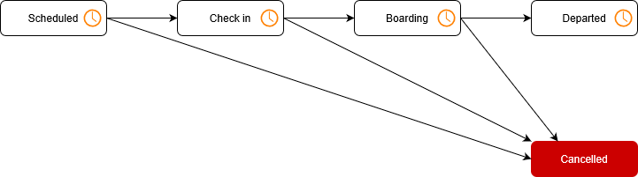

# Flight display system design
This document proposes the design for a flight display system in an airport.

## Considerations

### 1. Real-time updates
Flight information displayed is valuable only for as long as it remains relevant, especially when it calls for passengers to board or when it's used to communicate that a flight has been delayed or cancelled. A key consideration for the design must be to ensure low latency so users are kept informed, almost instantly, as changes occur.

### 2. Remote users
Users that will be accessing flight information remotely over the internet might be geographically dispersed over multiple time zones. Departure times and other events should be adapted so it's made relevant for where the user is located. An important consideration for the design must be to ensure that values which represent a time of day also retain other vital information that allows it to be interpreted and displayed correctly at any specific remote location.

### 3. Always on
Airports are known to operate flights around the clock, especially for large sporting events or over Christmas time each year. For this reason, it's paramount that the flight display system remains available at all times throughout the day. This constraint, however, must not hinder our ability to rapidly apply updates to the software. The design must protect against the risk of an outage in our primary data centre and also allow live deployment of changes to any component of the software.

### 4. Security
Multiple airlines will need to update only their own flight information. Specific design elements will describe how this data is protected from unauthorised updates by another airline or, possibly, an anonymous user on the internet. It's worth noting that not all users should be required to log in; it is airlines, only, that require elevated access.

### 5. Auditing
Because many users will have access to update the same information, our Compliance team suggests that we keep a record of all changes made for forensic auditing purposes. Initially, this should allow our Technical Support team to manually reconcile when updates have occurred and who the users were that performed them. In the longer term, as we get more airlines on-boarded and using the platform, we may need to store this data in a more structured way and define business roles that will have direct access to this information through self-service.

### 6. User feedback
With a strong focus on continuously improving the user experience, our UX team recommends enabling analytics to discover common patterns of how users interact with the software. Designing consumer-facing applications, they've come to terms with the fact that this may be the only practical way of getting real user feedback and learnt how easy it can be to obtain this information.

### 7. Observability
In order to ensure that the system is always available, our Operations team needs visibility of the components they're managing in our data centres. This will enable them to see when any components are taking strain or to respond quickly to identify the cause of any failures. It further provides insight to the capacity of the platform so that we're able to manage allocated resources in a more cost effective manner. We should also use mechnisms that alert us to failure before our users know about them.

## Methodology
> Agile, of course. Scrum? CMMI? Not that important for design to make sense. Given sprint 0 is for setting up project structure, etc. main components should take around 2 - 3 sprints to implement for a team of 4. Add one more sprint for setting up monitoring and stabilising in prod. Devs must review and give input too.

## Key concepts

### 1. Flights vs. configuration
From a purely technical stand-point, a "flight" can mean one of two things and it's important that we recognise this ubiquitous language when we discuss them. By doing this upfront, we eliminate unnecessary complexity down the line.

At least initially, a flight may be largely defined by its regular schedule and this type of (master) data can be thought of as configuration. However, as they _occur_ over time, we may experience them differently in every instance and this type of (transactional) data can be thought of as events. Because the inner-workings of these are entirely unique, we must introduce ways to distinguish them when we discuss their design and implementation.

### 2. Life-cycle
Various statuses are proposed for flights:
* On time
* Check in
* Boarding
* Departed
* Cancelled
* Delayed

It's tempting to just express these with a single attribute without considering the life-cycle for a flight. Let's start with a view of only these basic steps:


#### 2.1. Scheduled
This is the initial step in the life-cycle that marks when a flight will _occur_ and generates the entry to be tracked or updated by the display system.

#### 2.2. Check in
This step occurs when passengers are allowed to check in. By including a time duration in the flight configuration, we can advance to this step automatically in offset to the scheduled departure time.

#### 2.3. Boarding
Following boarding gates being assigned and only once it's also time to do so, this step occurs when passengers are called to board the flight. By including a default boarding gate as well as a time duration in the flight configuration, we can advance to this step automatically in offset to the scheduled departure time.

#### 2.4. Departed
This is the final step that occurs when the boarding gates have closed. In order to advance to this step, we update the actual departure time.

Now, also consider interruptions that might occur:



#### 2.5 Cancelled
This is another final step that might occur when a flight gets cancelled. In fact, once scheduled, a flight could be cancelled at any time.

Up until here, the proposed statuses for each step in the process are mutually exclusive.

#### 2.6. On time / delayed
A delay in departure could be anticipated anywhere along the process and 'Delayed' isn't thought of a step in the process. Rather, this additional attribute will be informed by any known impedements or it may be determined automatically through measurement of the process itself. By following this design, we allow this part of the system to evolve separately, so we can later incorporate further intelligence if needed.

Like 'Delayed', 'On Time' too isn't a step in the process nor is it even marked by any discrete event. Simply, it is the default assumed for when there's no evidence to report a delay.

## Data model

### 1. Configuration
Flights belong to an airline are configured with a flight number, source, destination and one or more schedules. These schedules may change over time and, as such, specify the window of time for which they remain effective. This allows for them to be updated beforehand, during office hours, or at times when airlines choose to regularly revise their flights.

Here's an example of the configuration for NZ0128 to Melbourne (MEL):
```json
{
    "_id": "57c860e9-b62e-4f5e-b3f9-a57a0259af56",
    "version": "1.9.4",
    "airlineId": "43d168c2-7ef3-4306-8251-834eee69a4d2",
    "flightNumber": "NZ0128",
    "sourceAirportId": "68b03a13-74c6-4d6e-80fa-8941569a4ec3",
    "destinationAirportId": "72d85aff-b976-4cec-a794-6afea7fc14d5",
    "schedules": [
        {
            "checkIn": {
                "offset": "1.00:00:00"
            },
            "boarding": {
                "gate": "G3",
                "offset": "30:00"
            },
            "departure": {
                "cronExpr": "0 30 6 ? * MON-FRI *",
                "cronTimeZone": "Pacific/Auckland"
            },
            "notBefore": "2019-07-01T00:00:00.000+12:00",
            "expires": "2020-07-01T00:00:00.000+12:00"
        },
        {
            "checkIn": {
                "offset": "12:00:00"
            },
            "boarding": {
                "offset": "20:00",
                "gate": "G3"
            },
            "departure": {
                "cronExpr": "0 30 6 ? * MON,WED,FRI *",
                "cronTimeZone": "Pacific/Auckland"
            },
            "notBefore": "2020-07-01T00:00:00.000+12:00",
            "expires": null
        }
    ]
}
```

In the above example, the value for `cronExpr` within `schedules[].departure` is a [cron](https://en.wikipedia.org/wiki/Cron) expression that denotes the regular departure times for the flight. The value for `cronTimeZone` provides the [IANA time zone](https://en.wikipedia.org/wiki/Tz_database) for occurrences of this expression.

The `checkin.offset` value represents the duration of time before departure when check in is allowed. And, similarly, the value for `boarding.offset`, when specified, tells when boarding will begin.

The properties `notBefore` and `expires` represent the window of time for which the schedule is effective. Moreover, this document may be seen as a template for when flights _occur_.

Besides this configuration for flights, other entities that are also configured include Airlines and Airports. Designs for these have not been articulated herein.

### 2. Flights
Provided its schedule given by the airline, a flight has a flight number, source, destination and a scheduled departure time. Although this document is complemented with more data as it progresses through its life-cycle, these particulars of the flight always remain immutable.

This is an example of flight NZ0128 as it's been scheduled initially for departure to Melbourne (MEL) at 6:30 am on Sunday, 16 August 2020:
```json
{
    "_id": "4655e3d4-d306-47e8-9070-1f12c8af8bd6",
    "version": "1.9.4",
    "airlineId": "43d168c2-7ef3-4306-8251-834eee69a4d2",
    "flightNumber": "NZ0128",
    "sourceAirportId": "68b03a13-74c6-4d6e-80fa-8941569a4ec3",
    "destinationAirportId": "72d85aff-b976-4cec-a794-6afea7fc14d5",
    "schedule": {
        "checkIn": {
            "time": "2020-08-15T00:18:30:00.000+12:00"
        },
        "boarding": {
            "time": "2020-08-16T00:06:10:00.000+12:00",
            "gate": "G3"
        },
        "departure": {
            "time": "2020-08-16T00:06:30:00.000+12:00"
        }
    },
    "isCancelled": false,
    "revision": {
        "checkIn": null,
        "boarding": null,
        "departure": null
    },
    "actual": {
        "departure": null
    }
}
```

The value for `schedule.checkIn.time` represents the time when passengers will be allowed to check in. Keep in mind that, unless the flight was pre-configured with details for boarding, the value for `schedule.boarding` might be `null` at this point in which case boarding will need to be manually started by the airline.

The structure for `revision` is a mirror of that for `schedule` and allows overriding in the event of a flight delay. When present, details from this section takes precedence over that from `schedule` (which is never updated).

The value for `actual.departure` will record the `time`, amongst other details, once the flight has finally departed.

## Components

### Web frontend
The proposed interface for both the flight display as well as airlines to administer their flights is a Single-Page Application (SPA). Web technologies provide a simplified distribution model and is in alignment with broader goals of the organisation.

Compelling frameworks to use include [Angular](https://angular.io/) and [Vue.js](https://vuejs.org/), although [React](https://reactjs.org/) is well within our compentency and the team decided to standardise on using this library for most of their development.


The technical criteria to meet is as follows:
* Hosted as static content and run entirely in the browser without the need for server-side compilation.
* Allows breaking down complex systems into separate [components](https://developer.mozilla.org/en-US/docs/Web/Web_Components) that are testable.
* Well supported and backed by a large community of developers.
* Compatible with libraries to work with [WebSocket](https://en.wikipedia.org/wiki/WebSocket) for receiving real-time updates.
* Compatible with libraries to work with [PushAPI](https://developer.mozilla.org/en-US/docs/Web/API/Push_API) for receiving asynchronous push notifications.
* Allows implementing the [OAuth2 Authorization Code grant](https://tools.ietf.org/html/rfc6749#section-1.3.1).

The web application can be deployed to an [Azure Storage Account](https://docs.microsoft.com/en-us/azure/storage/common/storage-account-overview) and delivered through Akamai or Azure CDN. Here's a useful comparison of the two:
https://www.trustradius.com/compare-products/akamai-vs-azure-cdn

### Database
In order to be support real-time updates, a centralised database is deemed adequate for being the source of truth if a complementary, in-memory, distributed cache is included to keep a copy of flight data specifically for frequently reads. Given that running in the cloud has been a strategic choice for the organisation, this could be fulfilled with [Azure SQL](https://azure.microsoft.com/en-us/services/sql-database/) and [Azure Cache for Redis](https://azure.microsoft.com/en-us/services/cache/).

Nevertheless, [Azure Cosmos DB](https://docs.microsoft.com/en-us/azure/cosmos-db/introduction) is a distributed database that solves both of these requirements with reduced complexity. After all, [relying on fewer components promises more reliability](https://en.wikipedia.org/wiki/Lusser%27s_law). Flight data can still be kept in a local cache by subscribing to the [change feed](https://docs.microsoft.com/en-us/azure/cosmos-db/change-feed) of the container, if needed.


### API backend
For airlines to administer flights and for users to view them, a REST API is proposed. Following the [OpenAPI](https://swagger.io/specification/) (Swagger) specification for documenting models and endpoints is recommended. This will simplify the integration and allow client code to be [generated](https://swagger.io/tools/swagger-codegen/). Endpoints used for administering flights should enforce [JWT](https://en.wikipedia.org/wiki/JSON_Web_Token) [Bearer Authentication](https://swagger.io/docs/specification/authentication/bearer-authentication/) and follow an authorization model for controlling user access, particulars which is not discussed in this document.

It is recommended to implement an ASP&#46;NET Core Web API.


This choice of technology meets the following criteria:
* The team is confident in working with this technology.
* Open source with a large community of developers behind it.
* Runs cross-platform and can be hosted with Linux containers.
* Supports working with [WebSocket](https://en.wikipedia.org/wiki/WebSocket). See also [SignalR](https://docs.microsoft.com/en-nz/aspnet/core/signalr/introduction?view=aspnetcore-3.1).

Useful libraries to consider:
* [Azure Cosmos DB .NET SDK](https://docs.microsoft.com/en-us/azure/cosmos-db/sql-api-sdk-dotnet) for data access.
* [ASP.NET Core OData](https://devblogs.microsoft.com/odata/asp-net-core-odata-now-available/) for parsing OData query string parameters and applying those over container projections.
* [MediatR](https://github.com/jbogard/MediatR) for basic [command-query separation](https://en.wikipedia.org/wiki/Command–query_separation) to organise logic implemented outside the service layer.
* [Serilog](https://serilog.net/) for semantic logging. Alternatively, [NLog](https://nlog-project.org/). Nevertheless, be sure adhere to [dependency inversion](https://en.wikipedia.org/wiki/Dependency_inversion_principle) and rely only on `ILogger`.

#### Endpoints

The proposed API will have this endpoint for viewing scheduled flights:

```http
GET /flights
```

Because not all flights will fit on the display at any one time, the API will also support pagination. Following the [OData](https://www.odata.org/) protocol is one way to achieve this:

Retrieve all scheduled flights for page 3.
```http
GET /flights?$skip=20&$top=10
```

Through composition, the API will expand the flight data returned to include details about the airline and destination so all information for the flight display is returned in a single HTTP response.

Embracing [HATEAOS](https://en.wikipedia.org/wiki/HATEOAS), the API furter includes hypermedia references that specify the URL where the JSON representations for the airline and destination airport resides. For this, inspiration can be drawn from [JSON-LD](https://json-ld.org/) or [HAL](https://en.wikipedia.org/wiki/Hypertext_Application_Language).

The API will have the following endpoints for airlines to configure new scheduled flights:

Configure a new scheduled flight.
```http
PUT /config/{airlineId}/{flightNumber}
X-api-version: 1
```

The above endpoint is [idempotent](https://en.wikipedia.org/wiki/Idempotence). This basically means a request can be safely retried without producing cumulative side-effects, like creating duplicates in the database. We design API like this so the caller isn't forced to assume the [connection is reliable](https://en.wikipedia.org/wiki/Two_Generals%27_Problem). This is particularly useful when we want to give the caller the option to favour [availablity over consistency](https://en.wikipedia.org/wiki/CAP_theorem) without sacraficing on the overall reliability. They could then choose to do this by handing off the request to be delivered through their durable queue that supports at-least-once delivery. This is a form of [eventual consistency](https://en.wikipedia.org/wiki/Eventual_consistency).

#### Testing

For unit testing and integration testing, [xUnit](https://xunit.net/) is recommended. An alternative option is [NUnit](https://nunit.org/). Both of those are good.

A good library for mocking/faking dependencies is [Moq](https://github.com/Moq/moq4/wiki/Quickstart). An alternative option is [NSubstitute](https://nsubstitute.github.io/). Again, both are great.

It's important that we run these tests as part of our build pipeline, when we also measure and report on code coverage.

### Worker
Background processing is necessary for triggering new flights to be added to the display. For this, an [ASP&#46;NET Core Worker Service](https://docs.microsoft.com/en-us/aspnet/core/fundamentals/host/hosted-services?view=aspnetcore-3.1&tabs=visual-studio) was considered. A compelling library to use is [Hangfire](https://www.hangfire.io/). Another good alternative (from an author I'd like to think I've once [inpired](https://github.com/tswanepoel/crongadgetry/issues/1#issuecomment-87811772)) is [Quartz.NET](https://www.quartz-scheduler.net/).

However, given the narrow purpose of the worker, a simple [Azure function](https://azure.microsoft.com/en-gb/services/functions/) will do.

## Environment

### Containers
> Docker, of course.

### Cluster
> Azure Kubernetes Service (AKS)? Azure AppService? Azure Contianer Registry? Azure Traffic Manager? WAF? Nginx ingress, of course. Rate limiting? SSL termination, probably. Compression.

### Monitoring
> Application Insights? Prometheus+Grafana? HealtCheck UI?

#### Smoke tests
> Azure Pipelines?

#### Alerting
> Teams? Slack? SMS?

### Analytics
> Google Analytics, Azure Log Analytics? Elasticsearch+Logstash+Kibana? Splunk?

## Source control
> Git, of course.

### Branches
> GitHub flow (or Git flow, if you must).

## Continuous integration
> Build PRs, run unit tests and integration tests, blue/green deployments, 